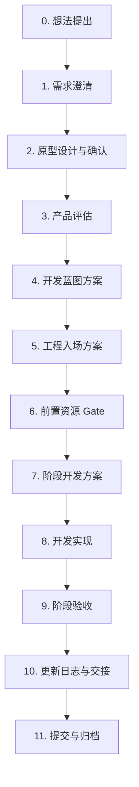

# AI 协作开发 SOP v1

本文件是当前最新开发 SOP。它定义从一个想法到可验收开发交付的标准流程，适用于后续任意 AI / 人工协作开发。

## 更新记录

| 更新时间 | 更新人员 | 更新背景 | 更新内容 |
|---|---|---|---|
| 2026-05-14 11:37:04 +08:00 | Codex | 多个 AI 先后开发后产生多份方案、阶段口径混乱，且开发中途才发现 Supabase、AI Key、营养库、真机、CLI 等前置资源未准备好。需要建立一套项目无关、可复用的开发 SOP。 | 创建第一版 SOP，覆盖需求澄清、原型确认、产品评估、开发蓝图、工程入场、前置资源 Gate、阶段方案、开发实现、阶段验收、日志交接和提交归档。 |

## 核心原则

1. 先确认需求，再写方案，再开发。
2. 先确认原型，再进入产品评估。
3. 先确认前置资源，再进入真实联调。
4. 任何阶段都必须有开发文档和验收文档。
5. 没有逐条验收，不得标记完成。
6. 缺少外部资源时只能标记 `PARTIAL`，不得假装完成。
7. 每次开始和结束都必须留下可追溯记录。
8. AI 不得绕过用户确认擅自改变产品主线、架构边界、真实服务或生产环境。

## 标准流程



## 0. 想法提出

目标：把用户的初始想法收敛成一个可讨论的问题。

用户负责：

- 说明要解决什么问题。
- 说明目标用户是谁。
- 说明为什么现在要做。

AI 负责：

- 复述需求。
- 找出模糊点。
- 指出明显风险。
- 不急着写代码。

产出：需求草案或聊天确认记录。

进入下一步标准：用户确认“需求方向正确”。

## 1. 需求澄清

目标：把想法变成可评估需求。

必须澄清：

- 用户是谁。
- 使用场景是什么。
- 核心动作是什么。
- 输入、输出、状态变化是什么。
- 成功标准是什么。
- 不做什么。
- 是否涉及账号、支付、隐私、第三方服务、生产环境。

AI 负责：

- 主动提问。
- 给出更有用的产品建议。
- 不局限于用户原话。
- 明确哪些是必须做、哪些是可后置。

产出：需求说明，可写入 `docs/requirements/` 或项目约定位置。

进入下一步标准：用户确认需求范围和不做范围。

## 2. 原型设计与确认

目标：先确认用户体验，再进入产品和工程评估。

原型可以是：

- 低保真页面流。
- HTML 原型。
- Figma 原型。
- 手绘结构说明。
- 关键页面截图。

必须确认：

- 首屏是什么。
- 用户从哪里开始。
- 每一步看到什么。
- 每一步点哪里。
- 错误、空状态、加载状态是什么。
- 移动端和桌面端是否都需要。

AI 负责：

- 先做最小可确认原型。
- 标出关键交互。
- 不用原型替代需求确认。

用户负责：

- 明确确认原型可作为产品方向。
- 指出必须修改的体验问题。

进入下一步标准：用户明确说“原型确认”或等价表达。

## 3. 产品评估

目标：判断这个需求是否值得做、怎么做最有用。

必须评估：

- 对用户是否真的有用。
- 是否符合产品主线。
- 是否可以更小范围交付。
- 是否会制造长期技术债。
- 是否依赖尚未准备好的资源。
- 是否需要真实服务、真机、生产环境或外部审核。

AI 必须输出：

- 推荐方案。
- 不推荐方案。
- 风险。
- 最小可交付范围。
- 需要用户确认的决策。

进入下一步标准：用户确认采用哪个产品方案。

## 4. 开发蓝图方案

目标：把确认后的产品方案变成长期技术蓝图。

开发蓝图必须包含：

- 产品目标。
- 阶段划分。
- 信息架构。
- 页面 / 功能范围。
- 数据结构。
- API / 服务边界。
- 算法 / AI / Prompt 约束。
- 权限 / 安全 / 隐私。
- 环境变量和密钥边界。
- 部署和发布策略。
- 验收总标准。

规则：

- 每个项目只能有一个当前权威蓝图。
- 后续阶段开发文档必须从蓝图拆解。
- 不允许多个 AI 各写一份互相竞争的开发方案。

进入下一步标准：用户确认蓝图作为当前唯一开发依据。

## 5. 工程入场方案

目标：让任何 AI 或开发者进入项目后知道从哪里开始。

必须建立：

- 项目入口文档。
- AI 工作手册。
- 当前工作指针。
- 任务日志。
- 文档索引。
- 代码目录说明。
- 禁止事项。
- 提交和验收规则。

必须说明：

- 哪些目录是正式代码。
- 哪些目录是当前文档。
- 哪些目录是历史归档。
- 哪些文件不能改。
- 哪些操作必须用户批准。

进入下一步标准：新 AI 只读入口文档即可找到蓝图、阶段文档、验收文档和当前任务。

## 6. 前置资源 Gate

目标：在开发前发现账号、密钥、数据、设备、CLI、权限等阻塞项。

每个阶段开发前必须列出三类资源。

### 用户必须提供

示例：

- 第三方项目 URL / Project Ref。
- Anon Key / Service Role Key / API Key。
- 是否允许执行数据库 migrations。
- 是否允许创建 bucket / queue / topic / index。
- 是否允许开启扩展，例如 pgvector。
- 真实测试设备。
- 真实数据集。
- 生产或测试环境访问权限。

### AI 可以准备

示例：

- `.env.example`。
- migration 文件。
- seed 脚本。
- mock fallback。
- 环境检查脚本。
- Dashboard 手动操作方案。
- 本机 CLI 检查命令。
- 验收脚本。

### 缺失时的降级策略

示例：

- 无真实数据库：只能完成本地/mock 开发。
- 无真实 AI Key：只能完成 mock provider 验收。
- 无真实数据集：只能完成小样本 seed 验收。
- 无真机：只能完成本机/Web/模拟器验收。
- 无 CLI：可以准备 SQL/Dashboard 手动方案，但不能标记真实执行完成。

进入下一步标准：

- 用户选择真实联调、mock 先行或暂停补齐环境。
- 阶段文档明确哪些资源已具备，哪些缺失，缺失项如何降级。

## 7. 阶段开发方案

目标：把蓝图拆成可执行阶段。

每个阶段必须有：

- 阶段目标。
- 范围内。
- 范围外。
- 前置资源 Gate。
- 任务列表。
- 数据结构引用。
- API / 服务引用。
- 算法 / AI / Prompt 引用。
- 用户流程。
- 验收要求。
- 风险和降级策略。

规则：

- 阶段文档必须来自总蓝图。
- 不得另起任务线。
- 不得把未准备好的真实联调写成已完成。

进入下一步标准：用户确认该阶段可开始。

## 8. 开发实现

目标：按阶段文档实现功能。

AI 开始前必须：

- 读取入口文档、蓝图、阶段文档、验收文档、当前工作、任务日志。
- 写开始记录。
- 更新当前工作指针。
- 先看现有代码实现方式。
- 输出实现计划和风险。
- 获得用户明确修改指令。

AI 开发中必须：

- 小步修改。
- 遵循现有架构。
- 不引入无关重构。
- 不写真实密钥。
- 不伪造外部服务结果。

AI 开发后必须：

- 跑检查。
- 记录无法验证项。
- 更新日志和交接。

## 9. 阶段验收

目标：证明阶段是否真的完成。

验收必须逐条标记：

- `PASS`：已完成并验证。
- `PARTIAL`：部分完成，写明缺口。
- `FAIL`：失败，写明原因。
- `N/A`：不适用，写明原因。

验收必须覆盖：

- 功能。
- 数据。
- 权限。
- 错误状态。
- 空状态。
- 测试命令。
- 真机/真实服务/外部资源。
- Android/iOS。
- 热更新。
- 是否需要重新打包。

规则：

- 没有真实资源，不得标记真实验收 `PASS`。
- 只有 mock 通过，只能写 mock 通过。
- 需要人工验证的项目必须明确列出。

## 10. 更新日志与交接

目标：让下一个 AI 不需要猜。

结束时必须记录：

- 结束时间。
- 谁做的。
- 完成了什么。
- 改了哪些文件。
- 为什么这样改。
- 跑了哪些命令。
- 哪些 PASS。
- 哪些 PARTIAL / FAIL / N/A。
- 阻塞项。
- 下一步。

当前工作指针必须更新到可接手状态。

## 11. 提交与归档

目标：让历史可追溯。

提交前必须：

- 确认只提交本任务相关文件。
- 不混入临时文件、密钥、缓存、无关改动。
- 提交信息说明任务范围。

归档规则：

- 旧方案、旧原型、旧任务进入归档目录。
- 当前入口只指向最新方案。
- 不保留多个看起来都有效的开发方案。

## 用户和 AI 的职责边界

用户必须负责：

- 业务目标。
- 原型确认。
- 产品方案确认。
- 第三方账号和密钥。
- 真实设备。
- 生产环境高风险操作授权。
- 是否继续、暂停或降级。

AI 必须负责：

- 提问澄清。
- 产品评估。
- 方案设计。
- 代码审计。
- 阶段拆解。
- 开发实现。
- 测试和验收记录。
- 更新日志和交接。

AI 不能擅自决定：

- 改变产品主线。
- 新增原生依赖。
- 迁移架构。
- 接入真实密钥。
- 执行生产数据库操作。
- 创建或删除真实云资源。
- 跳过原型确认。
- 跳过验收。

## 标准提示词

### 新需求启动

```text
请按标准 AI 协作开发 SOP 处理下面这个需求。

要求：
1. 先做需求澄清，不要直接开发。
2. 需要原型确认后，才能进入产品评估。
3. 产品评估后，再写开发蓝图和阶段方案。
4. 每个阶段必须有前置资源 Gate、开发文档和验收文档。
5. 任何代码修改前，必须先读取现有实现并与我确认。

需求：
...
```

### 阶段开发启动

```text
请按当前项目 SOP 开始 Phase X 开发。

要求：
1. 先读取入口文档、蓝图、阶段开发文档、验收文档、当前工作和任务日志。
2. 先检查前置资源 Gate，列出用户必须提供、AI 可准备、可 mock 降级的项目。
3. 写入开始记录并更新当前工作指针。
4. 审计现有代码实现方式。
5. 输出实现计划和风险，等我确认后再改代码。
6. 结束时按验收文档逐条 PASS / PARTIAL / FAIL / N/A，并写入任务日志。
```

### 阶段验收启动

```text
请按 Phase X 验收文档执行验收。

要求：
1. 不开发新功能，除非发现必须修复的阻塞缺陷并先说明。
2. 每一项验收必须标记 PASS / PARTIAL / FAIL / N/A。
3. 真实服务、真机、外部资源未验证时不得写 PASS。
4. 输出阻塞清单、需要我提供的资源、下一步建议。
```
